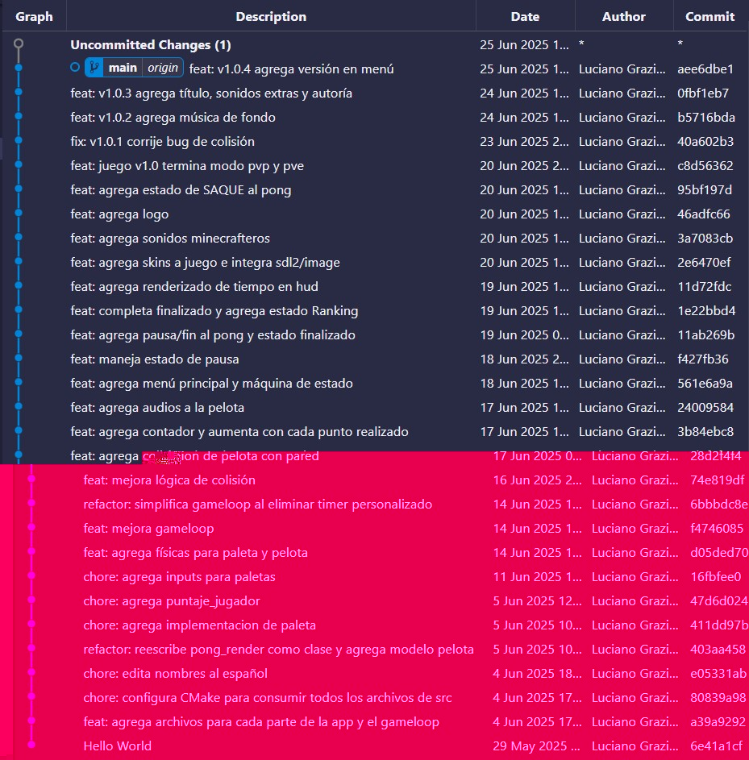

# Pong - Proyecto para "UADE::Introducción a la programación"

- Autor: Graziani Luciano <lgraziani@uade.edu.ar>. LU: 1222435.
- Materia: Introducción a la programación.
- Cursada: 2025.
- Fecha entrega: 25/06/2025.
- Profesor: Pepe Jonathan <jpepe@uadeeduar.onmicrosoft.com>.
- Ayudante: Narducci Adrián <adnarducci@uade.edu.ar>.
- Repositorio en github: https://github.com/lgraziani2712/uade-iprog-pong.

## Herramientas utilizadas en el proyecto:

- **Adobe Audition**: para recortar y comprimir sonidos.
- **Adobe Photoshop**: para editar las imágenes.
- **VSCode**: editor de código, compilador y debugger.
- **PowerShell**: terminal de línea de comandos.
- **Conan**: para administrar las dependencias del proyecto.
- **CMake**: para compilar la versión debugger y producción.
- **Clang**: para formatear el código.
- **Git**: para llevar historial de cambios y documentar el proceso.

## Recursos de terceros utilizados:

- Imágenes originales obtenidas a través de duckduck.go.
- Sonido original del fuego: https://pixabay.com/sound-effects/short-fire-whoosh-1-317280/.
- Stackoverflow y la web en general para las guías de uso de la librería SDL.
- Sonido original del punto: https://pixabay.com/sound-effects/success-340660/.
- Sonido original de navegación de menú: https://pixabay.com/sound-effects/radio-338296/.
- Sonido original de selección de opción del menú: https://pixabay.com/sound-effects/8-bit-victory-sound-101319/.
- Música: https://pixabay.com/music/video-games-best-game-console-301284/.
- Ícono original: https://www.freepik.com/icon/ping-pong_1687641.

## Proceso de desarrollo



## Requisitos técnicos

Este proyecto funciona con **Conan** + **CMake** para simplificar el proceso de instalación de dependencias, _buildeo_ y _debuggeo_.

Antes de correr nada, necesitamos asegurarnos que tenemos instaladas estas dependencias en nuestra computadora:

### Conan

De forma general y muy resumidamente, Conan es una herramienta para administrar dependencias de un proyecto escrito en C o C++. Para poder instalar Conan necesitamos tener instalado `python`. Python está fuera del alcance de este proyecto por lo que se recomienda buscar la forma oficial de instalarlo a parte. A continuación el comando para instalar Conan:

```sh
pip install conan
```

Tener `python` y con este comando recomendado de forma oficial como el proceso de instalación estándar nos aseguramos de tener autocompletado en los archivos `conanfile.py`.

#### Configuración extra para Conan

- **Cambiar el path por defecto donde Conan instala dependencias**: por defecto Conan guarda toda la información dentro de `C:\{USER}\.conan`. Si se desea cambiar el path por defecto, se debe crear una **variable de entorno** con `CONAN_HOME` como valor de la clave y un path como valor, por ejemplo: `CONAN_HOME="D:\.conan"`.

### CMake

`CMake`, `cl.exe` y todas las herramientas del ecosistema de C++ son instaladas por MSVC de Visual Studio. En el installer de Visual Studio debería haberse seleccionado la opción "Desktop development with C++".

## Comandos comunes

> Si ejecutamos comandos en la terminal, necesitamos abrir la terminal "Developer Command Prompt for VS 2022".

### (Primer comando) Configurar el perfil por defecto de conan:

```sh
conan profile detect
```

### Instalar dependencias para builds release y configurar conan:

```sh
conan install . --build=missing
```

> Con este comando Conan instala las dependencias especificadas en el archivo de recetas `conanfile.py`.
> Si alguna de estas dependencias no existe en el caché local, los buscará en los repositorios remotos. Cuando el grafo de dependencias esté computado y todas las dependencias fueran encontradas, buscará los binarios que coincidan con las settings de la computadora actual (que fueron generadas durante la detección del perfil).
>
> Si no hay un binario para alguna de las dependencias, fallará, a menos que se haya pasado el argumento `--build`, que indica a Conan que buildee las dependencias de forma local.
>
> Luego de la instalación de las dependencias, Conan llamará a los "generators" y "deployers".
>
> Esta documentación fue traducida sin inteligencia artificial del texto que el comando `conan install --help` entrega.

### Instalar y construir dependencias con el perfil de Debug:

> NOTA: no es necesario y lleva mucho tiempo, a menos que se quieran correr el entorno de debugeo.

```sh
conan install . -s build_type=Debug --build=missing
```

### Construir la aplicación con CMake

```sh
cmake --preset conan-default
```

Para build de debuggeo:

```sh
cmake --build --preset conan-debug
```

Para build release:

```sh
cmake --build --preset conan-release
```

Estos últimos dos comandos crean los ejecutables dentro de las carpetas `build/Debug` y `build/Release` respectivamente.

## Configuración básica para VSCode

- Las extensiones recomendades están declaradas en `.vscode/extensions.json`.
- Ejecutar los comandos básicos para Conan y CMake para generar los presets de build al menos una vez antes de abrir VSCode.
- La tarea para regenerar el build de Debug está configurada en `.vscode/tasks.json`.
- La ejecución por defecto está configurada para que levante la versión de Debug y definida en `.vscode/launch.json`.

## Configuración del entorno

Conan detecta y declara las siguientes propiedades en el perfil por defecto:

```ini
[settings]
arch=x86_64
build_type=Release
compiler=msvc
compiler.cppstd=20
compiler.runtime=dynamic
compiler.version=194
os=Windows
```

> RECOMENDACIÓN: cambiar el valor de la entrada `compiler.cppstd` a 20 mínimo.

Para saber dónde guarda el perfil por defecto podemos correr el siguiente comando:

```sh
 conan profile path default
```
